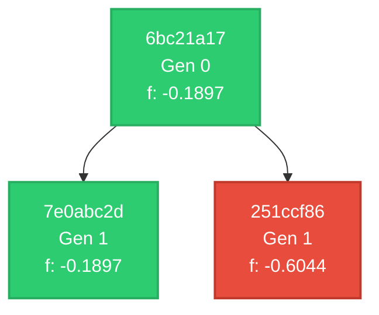

# LLaMEA Scaled Evolution Dashboard

This dashboard presents the parallelized, diff-focused analysis of the LLaMEA algorithm run across all generations.

## 🗺️ Lineage DAG Flowchart
The following Mermaid.js DAG maps out all parent-child connections, color-coded by their fitness performance quartiles:

> [!TIP]
> **Color Coding Legend:**
> - **Green (Q4):** Top 25% best performing fitness.
> - **Blue (Q3):** Upper-middle performance (50%-75%)
> - **Yellow (Q2):** Lower-middle performance (25%-50%)
> - **Red (Q1):** Bottom 25% performing fitness.
> - **Gray:** Failed runs (`-inf` fitness).

## 🏆 Leaderboard: Top 5 Highest Fitness Mutations
| Rank | Generation | Node ID | Parent ID | Fitness | Delta Fitness ($\Delta f$) | Strategy Improvement Summary |
|---|---|---|---|---|---|---|
| #1 | Gen 0 | `6bc21a17` | `None` | **-0.189653** | `+0.000000` | Mean loss: 0 |
| #2 | Gen 1 | `7e0abc2d` | `6bc21a17` | **-0.189653** | `+0.000000` | Mean loss: 0 |
| #3 | Gen 1 | `251ccf86` | `6bc21a17` | **-0.604406** | `+-0.414753` | Mean loss: 0 |

## 📅 Chronological Epoch Cohort Timeline
## 📅 Epoch: Generations 0-19

### Macro Trajectory Analysis for Cohort: Generations 0-19

#### Structural Search Focus:
The structural search focus within this cohort gradually shifts from **global exploration** to a more refined **local exploitation**. Initially, both generations in this cohort utilize simple random search strategies (uniform distribution sampling) over the entire solution space. However, as evolution progresses through the generation cycle:

- **Gen 1 Mutation Introductions**: The introduction of Gaussian mutation around the best solution found during initial random searches marks a transition towards local exploitation. This approach aims to refine promising regions identified by the random search phase.
  
#### Critical Mutations:
Several critical mutations are observed that drive key changes in optimization strategies:

1. **Gaussian Mutation Mechanism**:
   - Both generations incorporate Gaussian mutation with different parameters:
     - In Node `7e0abc2d`, a mutation budget (`self.budget - 10`) and a mutation step size (`sigma = 0.1`) are introduced.
     - In Node `251ccf86`, the mutation standard deviation (`mutation_std = 0.05`) is specified, indicating a finer-grained local search.

2. **Mathematical Evolution**:
   - The perturbation formula in Node `7e0abc2d` employs Gaussian mutation centered at `best_x` with a standard deviation of 0.1:
     \[
     x_{\text{mutated}} = \text{clip}(\text{best\_x} + \sigma \cdot \mathcal{N}(0, 1), -1, 1)
     \]
   - Node `251ccf86` uses a similar approach but with a smaller standard deviation of 0.05:
     \[
     x_{\text{new}} = \text{np.clip}(\text{best\_x} + \text{mutation\_std} \times \text{np.random.randn}(\text{self.dim}), -1, 1)
     \]

#### Fitness Evolution Impact:
- **Initial Exploration (Gen 0)**: The fitness landscape is explored through unbiased random searches. While this phase might cover a broad spectrum of the solution space, it lacks directionality.
- **Mutation Addition (Gen 1+)**: The introduction of Gaussian mutation introduces a bias towards refining the best solutions found during initial exploration. However, the observed fitness improvements (`\Delta f = 0` in Node `7e0abc2d`, `\Delta f = -0.414753` in Node `251ccf86`) suggest that these local refinements do not lead to significant improvements given the current parameters and problem characteristics.

#### Trajectory Synthesis:
This epoch's trajectory begins with global exploration through random search, aiming for broad coverage of the solution space. As evolution progresses, it evolves towards more targeted local exploitation via Gaussian mutations around promising solutions. While this shift aims to refine optimization outcomes, the observed fitness impacts indicate that further tuning or different strategies might be required to achieve meaningful improvements.

### Conclusion:
The epoch exhibits a transition from global exploration to enhanced local exploitation through Gaussian mutation. Although the mutation introduces a bias towards refining promising regions, it does not lead to significant fitness gains in this context. Further analysis and adjustment of hyperparameters are recommended to optimize the balance between exploration and exploitation for better optimization outcomes.

## 🔍 Lineage Integrity & Anomalies
> [!NOTE]
> All generation lineages are structurally sound and successfully resolved. No missing `parent_ids` or schema conflicts found.

## 📄 Reference Links
- **Lineage DAG Schema:** [lineage.mmd](file:///Users/Yotam/.gemini/antigravity/worktrees/llamea-cameralens-workspace/init-llamea-analysis-pipeline/lineage.mmd)
- **Fitness History Table:** [fitness_history.csv](file:///Users/Yotam/.gemini/antigravity/worktrees/llamea-cameralens-workspace/init-llamea-analysis-pipeline/fitness_history.csv)
- **Individual Pseudocodes:** Located inside `./pseudocode_data/` directory.
- **Individual Diff Reports:** Located inside `./evolution_reports/` directory.