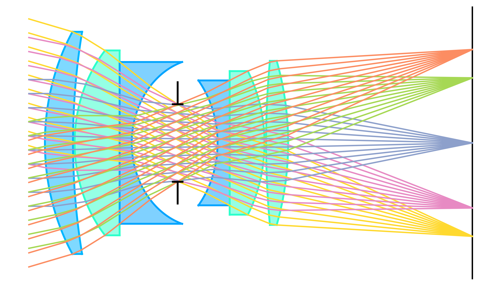

<div align="center">

# Camera Lens Simulation

</div>

<div align="center">

<a href="https://mit-license.org/"></a>
<a href="https://www.python.org/downloads/"></a>
<a href="https://github.com/psf/black"></a>
<a href="https://github.com/AntKirill/CameraLensSimulation"></a>

</div>

`CameraLensSimulation` implements geometric ray tracing in JAX and provides loss builders and optimizers for lens design. The project includes reference glass catalogs, Zemax-style parsers, plotting utilities, and the LDG-EA evolutionary optimizer for global search.

<p align="center">
  
</p>

## Features

- JAX-based ray tracing with 64-bit support for rotationally symmetric spherical/planar surfaces (`lensgopt/optics/optics.py`, `lensgopt/optics/shapes.py`).
- Lens system data model with paraxial solvers for entrance pupil, sensor plane, and effective focal length (`lensgopt/optics/model.py`).
- Loss factories to optimize curvatures, separations, and glass choices; ready to pack/unpack subsets of parameters (`lensgopt/optics/loss.py`).
- Sellmeier glass catalogs with Schott data and helper utilities to resolve refractive indices at selected lines (for example C/D/F) (`lensgopt/materials/refractive_index_catalogs.py`, `lensgopt/materials/databases/schott-optical-glass-overview-excel-format-en.xlsx`).
- Visualization of lens layouts and ray fans for debugging or reporting (`lensgopt/visualization/lens_vis.py`).
- Parsers and ready-made examples, including a Double-Gauss design expressed in a Zemax-compatible text file (`lensgopt/parsers/zmax_fmt.py`, `lensgopt/parsers/lenses/double_gauss_schott.txt`, `examples/double-gauss-de-example.ipynb`).
- Source code for the lens-descriptor-guided evolutionary algorithm (LDG-EA) for global quality-diversity optimisation of constrained optical designs. The methodology is summarized in the diagram below.

<p align="center">
  
</p>

## Getting started

Prerequisites:

- A C++17 toolchain if you want to build HillVallEA yourself (e.g., MSVC Build Tools on Windows).
- Python 3.10+ (required by the pinned dependency set, including JAX).
- For accurate optics calculations, enable JAX 64-bit mode.

Install:

```bash
pip install -e .  # installs dependencies, auto-initializes submodules, and builds hillvallimpl
```

### Recompiling Only the C++ Extension

If you change only the C++ code and want to rebuild without reinstalling the package:

```bash
python setup.py build_ext --inplace
```

---

### Fetching External Dependencies

Initialize external dependencies with git submodules:

```bash
git submodule update --init --recursive
```

This step is optional if you install with `pip install -e .`, because build hooks automatically initialize `external/HillVallEA` when needed.

Or clone the external repository explicitly:

```bash
cd external
git clone https://github.com/AntKirill/HillVallEA
```

## Repository map

- `lensgopt/optics/`: ray tracing kernels, paraxial solvers, and loss factories.
- `lensgopt/materials/`: glass catalogs and Sellmeier helpers.
- `lensgopt/parsers/`: Zemax-format parser plus canned lens builders (e.g., Double-Gauss).
- `lensgopt/visualization/`: plotting utilities for lens layouts, rays, and landscapes.
- `examples/`: notebooks and scripts showing optimisation workflows.

## Performance (Double-Gauss benchmark)

From the final cell of `examples/double-gauss-example.ipynb` on a Windows / Python 3.10 setup (Intel Core Ultra 9 185H, 16 threads, 32 GB RAM):

| Kernel       | Time (ms) | Speed vs MATLAB loss |
| ------------ | --------- | -------------------- |
| JAX Loss     | 1.5       | 8.78× faster         |
| JAX Grad     | 9.0       | 1.50× faster         |
| MATLAB Loss  | 13.5      | 1.0× (baseline)      |
| PyTorch Loss | 72.3      | 0.19×                |

JAX wins both absolute loss computation time and gradient computation speed, while still using double precision for accuracy.

## Quick example (Double-Gauss)

```python
import jax
from examples.double_gauss_objective import DoubleGaussObjective

jax.config.update("jax_enable_x64", True)

objective = DoubleGaussObjective()
x0_cont, x0_ids = objective.init_from_templates()
theta0 = objective.pack_theta(x0_cont, x0_ids)

# Plot the Double-Gauss design
fig, ax, loss0 = objective.visualize(
    theta=theta0,
    use_latex=False,
    num_rays=10,
)
print(f"Loss = {loss0:.8f}")
fig.savefig("double_gauss.png", dpi=300, bbox_inches="tight")
```

To optimize a subset of parameters (curvatures, gaps, glass IDs), pass `objective.objective_theta` to an optimizer. The notebook in `examples/double-gauss-de-example.ipynb` shows a Differential Evolution workflow with this objective.

## Citation

If you use Camera Lens Simulation, please cite:

- Paper: https://arxiv.org/abs/2601.22075

```bibtex
@article{antonov2026ldgea,
  title={Lens-descriptor guided evolutionary algorithm for optimisation of complex optical systems with glass choice},
  author={Antonov, Kirill and Tukker, Teus and Botari, Tiago and B\"ack, Thomas H. W. and Kononova, Anna V. and van Stein, Niki},
  journal={arXiv preprint arXiv:2601.22075},
  year={2026},
  doi={10.48550/arXiv.2601.22075},
  url={https://arxiv.org/abs/2601.22075}
}
```
