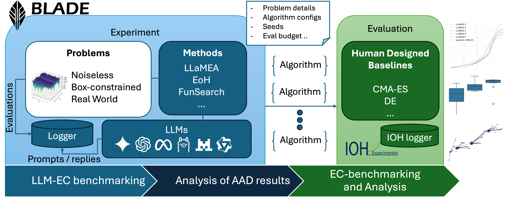

.. BLADE documentation master file, created by
   sphinx-quickstart on Mon Mar  3 09:42:40 2025.
   You can adapt this file completely to your liking, but it should at least
   contain the root `toctree` directive.

BLADE
===========================================================

.. image:: https://badge.fury.io/py/blade.svg
   :target: https://pypi.org/project/blade/
   :alt: PyPI version
   :height: 18
.. image:: https://img.shields.io/badge/Maintained%3F-yes-brightgreen.svg
   :alt: Maintenance
   :height: 18
.. image:: https://img.shields.io/badge/Python-3.11+-blue.svg
   :alt: Python 3.11+
   :height: 18
.. image:: https://codecov.io/gh/XAI-liacs/BLADE/graph/badge.svg?token=ZOT67R1TP7
   :target: https://codecov.io/gh/XAI-liacs/BLADE
   :alt: Codecov
   :height: 18
.. image:: https://colab.research.google.com/img/colab_favicon_256px.png
   :target: https://colab.research.google.com/drive/1gJPpQPvCGu0v2LoSsxtdGmot73A-ypSf?usp=sharing
   :alt: Colab Notebook
   :height: 18

**BLADE** is a Python framework for benchmarking the Llm Assisted Design and Evolution of algorithms.
**BLADE** (Benchmark suite for LLM-driven Automated Design and Evolution) provides a standardized benchmark suite for evaluating automatic algorithm design algorithms, particularly those generating metaheuristics by large language models (LLMs).
It focuses on **continuous black-box optimisation** and integrates a diverse set of **problems** and **methods**, facilitating fair and comprehensive benchmarking.

🔥 News
--------

- 2025.03 ✨✨ **iohblade v0.0.1 released**!

Features
--------

- **Comprehensive Benchmark Suite:** Covers various classes of black-box optimisation problems.
- **LLM-Driven Algorithm Design:** Supports algorithm evolution and design using large language models.
- **Built-In Baselines:** Includes state-of-the-art metaheuristics for comparison and LLM-driven AAD algorithms.
- **Automatic Logging & Visualization:** Integrated with **IOHprofiler** for performance tracking.

Included Benchmark Function Sets
--------------------------------

BLADE incorporates several benchmark function sets to provide a comprehensive evaluation environment:

.. list-table::
   :header-rows: 1
   :widths: 25 50 15 10

   * - Name
     - Short Description
     - Number of Functions
     - Multiple Instances
   * - **BBOB** (Black-Box optimisation Benchmarking)
     - A suite of 24 noiseless functions designed for benchmarking continuous optimisation algorithms. `Reference <https://arxiv.org/pdf/1903.06396>`_
     - 24
     - Yes
   * - **SBOX-COST**
     - A set of 24 boundary-constrained functions focusing on strict box-constraint optimisation scenarios. `Reference <https://inria.hal.science/hal-04403658/file/sboxcost-cmacomparison-authorversion.pdf>`_
     - 24
     - Yes
   * - **MA-BBOB** (Many-Affine BBOB)
     - An extension of the BBOB suite, generating functions through affine combinations and shifts. `Reference <https://dl.acm.org/doi/10.1145/3673908>`_
     - Generator-Based
     - Yes
   * - **GECCO MA-BBOB Competition Instances**
     - A collection of 1,000 pre-defined instances from the GECCO MA-BBOB competition, evaluating algorithm performance on diverse affine-combined functions. `Reference <https://iohprofiler.github.io/competitions>`_
     - 1,000
     - Yes

In addition, several real-world applications are included, such as several photonics problems.

Included Search Methods
-----------------------

The suite contains the state-of-the-art LLM-assisted search algorithms:

.. list-table::
   :header-rows: 1
   :widths: 20 50 30

   * - Algorithm
     - Description
     - Link
   * - **LLaMEA**
     - Large Language Model Evolutionary Algorithm
     - `code <https://github.com/nikivanstein/LLaMEA>`_, `paper <https://arxiv.org/abs/2405.20132>`_
   * - **EoH**
     - Evolution of Heuristics
     - `code <https://github.com/FeiLiu36/EoH>`_, `paper <https://arxiv.org/abs/2401.02051>`_
   * - **FunSearch**
     - Google's GA-like algorithm
     - `code <https://github.com/google-deepmind/funsearch>`_, `paper <https://www.nature.com/articles/s41586-023-06924-6>`_
   * - **ReEvo**
     - Large Language Models as Hyper-Heuristics with Reflective Evolution
     - `code <https://github.com/ai4co/LLM-as-HH>`_, `paper <https://arxiv.org/abs/2402.01145>`_
   * - **LLM-Driven Heuristics Neighbourhood Search**
     - LLM-Driven Neighborhood Search for Efficient Heuristic Design
     - `code <https://github.com/Acquent0/LHNS>`_, `paper <https://ieeexplore.ieee.org/abstract/document/11043025>`_
   * - **Monte Carlo Tree Search**
     - Monte Carlo Tree Search for Comprehensive Exploration in LLM-Based Automatic Heuristic Design
     - `code <https://github.com/zz1358m/MCTS-AHD-master/tree/main>`_, `paper <https://arxiv.org/abs/2501.08603>`_

.. note::
   ``FunSearch`` is currently not yet integrated.

Supported LLM APIs
------------------

BLADE supports integration with various LLM APIs to facilitate automated design of algorithms:

.. list-table::
   :header-rows: 1
   :widths: 15 50 35

   * - LLM Provider
     - Description
     - Integration Notes
   * - **Gemini**
     - Google's multimodal LLM designed to process text, images, audio, and more. `Reference <https://en.wikipedia.org/wiki/Gemini_(language_model)>`_
     - Accessible via the Gemini API, compatible with OpenAI libraries. `Reference <https://ai.google.dev/gemini-api/docs/openai>`_
   * - **OpenAI**
     - Developer of GPT series models, including GPT-4, widely used for natural language understanding and generation. `Reference <https://openai.com/>`_
     - Integration through OpenAI's REST API and client libraries.
   * - **Ollama**
     - A platform offering access to various LLMs, enabling local and cloud-based model deployment. `Reference <https://www.ollama.ai/>`_
     - Integration details can be found in their official documentation.
   * - **Claude**
     - Anthropic's Claude models for safe and capable language generation. `Reference <https://www.anthropic.com/>`_
     - Accessed via the Anthropic API.
   * - **DeepSeek**
     - Developer of the DeepSeek family of models for code and chat. `Reference <https://www.deepseek.com/>`_
     - Access via OpenAI compatible API at ``https://api.deepseek.com``.

Evaluating against Human Designed Baselines
-------------------------------------------

An important part of BLADE is the final evaluation of generated algorithms against state-of-the-art human-designed algorithms. In the ``iohblade.baselines`` part of the package, several well-known SOTA black-box optimizers are implemented to compare against, including but not limited to CMA-ES and DE variants.

For the final validation, **BLADE** uses **IOHprofiler**, providing detailed tracking and visualization of performance metrics.

🤖 Contributing
-----------------

Contributions to BLADE are welcome! Here are a few ways you can help:

- **Report Bugs**: Use `GitHub Issues <https://github.com/XAI-liacs/BLADE/issues>`_ to report bugs.
- **Feature Requests**: Suggest new features or improvements.
- **Pull Requests**: Submit PRs for bug fixes or feature additions.

Please refer to ``CONTRIBUTING.md`` for more details on contributing guidelines.

License
---------

Distributed under the `MIT <https://choosealicense.com/licenses/mit/>`_ License.
See ``LICENSE`` for more information.

Cite us
--------

If you use BLADE in your research, please consider citing the associated paper:

.. code-block:: bibtex

   TBA

.. toctree::
   :maxdepth: 2
   :caption: Contents:

   Introduction
   Installation
   benchmarks
   webapp
   modules
   notebooks/simple_experiment
   notebooks/custom_problem
   notebooks/custom_method
   notebooks/mabbob_example
   notebooks/visualization_options

Indices and tables
==================

* :ref:`genindex`
* :ref:`modindex`
* :ref:`search`
