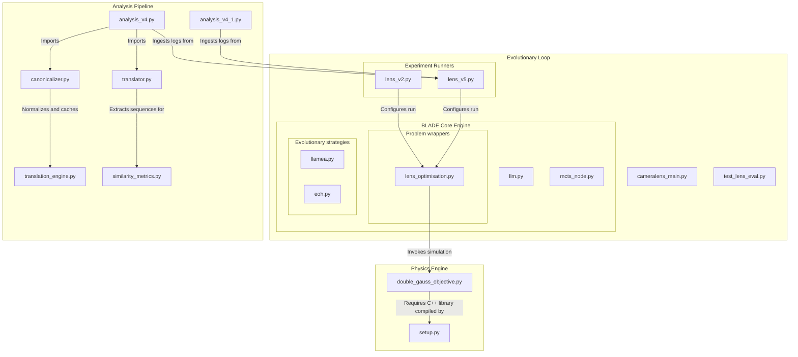

# Codebase Architecture Map

This document maps out the entire workspace layout, explaining how the components of the **Camera Lens Simulation Physics Engine**, the **BLADE evolutionary framework**, and the **Output Analysis Pipeline** are interconnected.

---

## Codebase Component Layout

---

## 1. Physics Engine: `camera-lens-simulation/`
Contains the core physics simulations and material models responsible for evaluating camera lens structures.

* **[setup.py](file:///Users/Yotam/Downloads/thesis_temporary_code/lens_v4_conitnuation/llamea-cameralens-workspace/camera-lens-simulation/setup.py):**
  Build script compiling the `lensgopt` C++ extension (e.g. HillVallEA implementation).
* **[examples/double_gauss_objective.py](file:///Users/Yotam/Downloads/thesis_temporary_code/lens_v4_conitnuation/llamea-cameralens-workspace/camera-lens-simulation/examples/double_gauss_objective.py):**
  Defines `DoubleGaussObjective` which computes the optical loss (aberrations, focal length deviations, constraints) of a given lens configuration.

---

## 2. Evolutionary Loop: `blade-framework/`
Orchestrates the LLM evolutionary loop (LLaMEA / ReEvo) that iteratively evolves optimization classes.

* **[cameralens_main.py](file:///Users/Yotam/Downloads/thesis_temporary_code/lens_v4_conitnuation/llamea-cameralens-workspace/blade-framework/cameralens-main.py):**
  Global entrypoint for scan-running and managing lens optimization experiments.
* **[test_lens_eval.py](file:///Users/Yotam/Downloads/thesis_temporary_code/lens_v4_conitnuation/llamea-cameralens-workspace/blade-framework/test_lens_eval.py):**
  Sanity checker ensuring the evaluation physics pipeline is working and yielding numerical fitness.
* **[camera_problem_runs/](file:///Users/Yotam/Downloads/thesis_temporary_code/lens_v4_conitnuation/llamea-cameralens-workspace/blade-framework/camera_problem_runs/):**
  Contains concrete version runners (e.g. `lens_v2.py`, `lens_v5.py`). These scripts prompt the LLM, receive code, run them against simulations, and log data.

---

## 3. Core Engine: `iohblade/`
The foundation wrapper classes for problems, methods, and API communication.

* **[iohblade/llm.py](file:///Users/Yotam/Downloads/thesis_temporary_code/lens_v4_conitnuation/llamea-cameralens-workspace/blade-framework/iohblade/llm.py):**
  Manages client calls and API retries for models like OpenAI, Anthropic, Gemini, and local Ollama.
* **[iohblade/problems/lens_optimisation.py](file:///Users/Yotam/Downloads/thesis_temporary_code/lens_v4_conitnuation/llamea-cameralens-workspace/blade-framework/iohblade/problems/lens_optimisation.py):**
  The wrapper evaluating the LLM-generated `Optimizer` classes on Double-Gauss design runs, implementing the sandbox execution.
* **[iohblade/methods/llamea.py](file:///Users/Yotam/Downloads/thesis_temporary_code/lens_v4_conitnuation/llamea-cameralens-workspace/blade-framework/iohblade/methods/llamea.py):**
  Implements the LLaMEA (LLM-driven Evolutionary Algorithm) loop.

---

## 4. Output Analysis: `output-analysis/`
Extracts code, normalizes variables, recursively translates chunks to pseudocode, and matches sequence patterns.

* **[src/analysis_v4_1.py](file:///Users/Yotam/Downloads/thesis_temporary_code/lens_v4_conitnuation/llamea-cameralens-workspace/blade-framework/output-analysis/src/analysis_v4_1.py):**
  Ingests `log.jsonl` and `conversationlog.jsonl`, sanitizes code via AST unparsing, and generates `stripped_data/variables.json`.
* **[src/analysis_v4.py](file:///Users/Yotam/Downloads/thesis_temporary_code/lens_v4_conitnuation/llamea-cameralens-workspace/blade-framework/output-analysis/src/analysis_v4.py):**
  The main orchestrator triggering extraction, recursive translation, and similarity processing.
* **[src/canonicalizer.py](file:///Users/Yotam/Downloads/thesis_temporary_code/lens_v4_conitnuation/llamea-cameralens-workspace/blade-framework/output-analysis/src/canonicalizer.py):**
  Tokenizes variable names, standardizes operations, and implements cache propagation.
* **[src/translator.py](file:///Users/Yotam/Downloads/thesis_temporary_code/lens_v4_conitnuation/llamea-cameralens-workspace/blade-framework/output-analysis/src/translator.py):**
  AST-based recursive parser. Isolates indentation levels and runs deepest-first translations via local Ollama.
* **[src/translation_engine.py](file:///Users/Yotam/Downloads/thesis_temporary_code/lens_v4_conitnuation/llamea-cameralens-workspace/blade-framework/output-analysis/src/translation_engine.py):**
  Leverages fuzzy string ratios and LLM semantic checks to map variations of pseudocode statements to canonical Line IDs.
* **[src/similarity_metrics.py](file:///Users/Yotam/Downloads/thesis_temporary_code/lens_v4_conitnuation/llamea-cameralens-workspace/blade-framework/output-analysis/src/similarity_metrics.py):**
  Builds sequence lists of Line IDs and calculates a pairwise Levenshtein similarity matrix between all classes.
