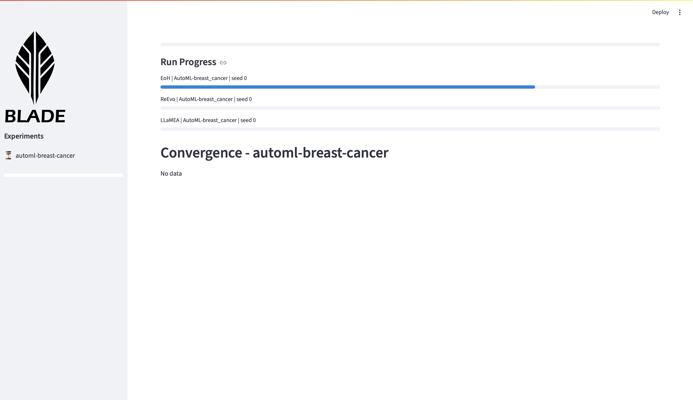

Webapp
======

BLADE includes a simple Streamlit-based web application for browsing experiments.
It can be used both while an experiment is running and after it has finished.

Use Cases
---------

- Monitor the progress of running experiments.
- Inspect convergence of completed experiments.
- Download the best discovered solutions.

Running the App
---------------

Start the web application with:

.. code-block:: bash

   uv run iohblade-webapp

Alternatively you can run it directly:

.. code-block:: bash

   python -m iohblade.webapp

The app scans the ``results`` directory for experiments containing a
``progress.json`` file.

Monitoring Experiments
----------------------

The sidebar lists all discovered experiments and shows their progress.
Selecting an experiment reveals overall progress and the status of each
run.

Inspecting Results
------------------

Once an experiment is finished, the webapp displays convergence plots and
summaries of the top solutions. Methods and problems can be filtered and
runs can be aggregated.

.. image:: blade-analyze.png
   :alt: Blade, work in progress.
   :width: 100%
